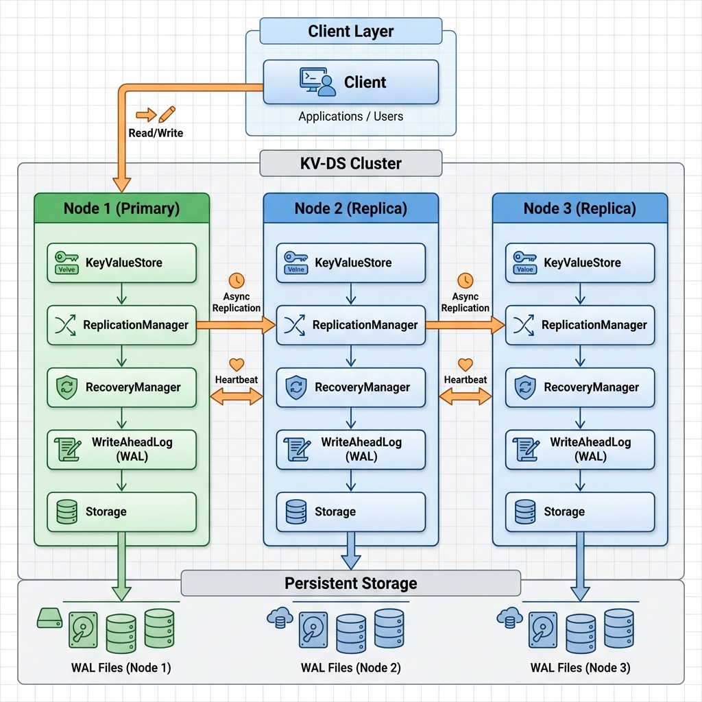

# KV-DS: Distributed Key-Value Data Store

A high-performance, distributed key-value data store with Write-Ahead Logging (WAL), automatic crash recovery, multi-node replication, and automatic failover.

## 🎯 Features

✅ **In-Memory Storage** - Fast ConcurrentHashMap-based storage with O(1) operations  
✅ **Write-Ahead Logging (WAL)** - Durability guarantee for all write operations  
✅ **Automatic Recovery** - Replays WAL on startup to restore state after crashes  
✅ **Thread-Safe** - Concurrent access support using thread-safe data structures  
✅ **Data Replication** - Asynchronous replication across multiple nodes  
✅ **Automatic Failover** - Automatic primary election when primary node fails  
✅ **Async WAL** - High-throughput batched writes for improved performance  
✅ **SOLID Principles** - Clean architecture with clear separation of concerns  
✅ **Comprehensive Tests** - 100+ unit and integration tests with >80% coverage  

## 📐 Architecture



### System Components

The project follows SOLID principles with clear separation of concerns:

#### Core Layers
- **Storage Layer** (`Storage`, `InMemoryStorage`) - Manages in-memory key-value storage using ConcurrentHashMap
- **WAL Layer** (`WriteAheadLog`, `WriteAheadLogImpl`, `AsyncWriteAheadLog`) - Handles durable logging with sync/async modes
- **Recovery Layer** (`RecoveryManager`, `RecoveryManagerImpl`) - Replays WAL on startup for crash recovery
- **Replication Layer** (`ReplicationManager`, `SimpleReplicationManager`) - Multi-node replication and failover
- **Core Layer** (`KeyValueStore`, `KeyValueStoreImpl`) - Coordinates all operations

#### Replication Architecture

**3-Node Cluster:**
- **Primary Node (Node 1)**: Accepts all write operations, replicates to replicas
- **Replica Nodes (Node 2, 3)**: Receive replicated data, can become primary on failover
- **Heartbeat Monitoring**: All nodes monitor each other (1-second interval)
- **Automatic Failover**: When primary fails, replica with lowest ID becomes new primary

**Data Flow:**
1. Client sends write to Primary
2. Primary writes to local WAL (durable)
3. Primary updates local storage
4. Primary asynchronously replicates to all replicas
5. Replicas apply changes to their local storage

## 🚀 Quick Start

### Prerequisites

- **Java**: 17 or higher
- **Maven**: 3.6 or higher

### Build the Project

```bash
mvn clean compile
```

### Run Tests

```bash
# Run all tests
mvn clean test

# Run specific test
mvn test -Dtest=KeyValueStoreImplTest
mvn test -Dtest=SimpleReplicationManagerTest
```

### Build JAR

```bash
mvn clean package
```

## 💻 Usage Examples

### 1. Basic Usage (Single Node, No WAL)

```java
import com.kvds.core.*;
import com.kvds.storage.*;

// Create simple in-memory store
Storage storage = new InMemoryStorage();
KeyValueStore store = new KeyValueStoreImpl(storage);

// Store and retrieve data
store.put("user:1", "Alice");
store.put("user:2", "Bob");

String user1 = store.get("user:1");  // Returns "Alice"

// Delete and clear
store.delete("user:1");
store.clear();

// Close when done
store.close();
```

### 2. Production Usage (Single Node with WAL)

```java
import com.kvds.core.*;
import com.kvds.storage.*;
import com.kvds.wal.*;
import com.kvds.recovery.*;

// Create store with WAL for durability
Storage storage = new InMemoryStorage();
WriteAheadLog wal = new WriteAheadLogImpl("./data/wal.log");
RecoveryManager recovery = new RecoveryManagerImpl();
KeyValueStore store = new KeyValueStoreImpl(storage, wal, recovery);

// All operations are now durable
store.put("config:timeout", "30");
store.put("config:retries", "3");

// Even if system crashes, data is safe in WAL
// On restart, recovery happens automatically

store.close();
```

### 3. High-Performance Mode (Async WAL)

```java
import com.kvds.wal.*;

// Create async WAL for higher throughput
WriteAheadLog syncWal = new WriteAheadLogImpl("./data/wal.log");
AsyncWriteAheadLog asyncWal = new AsyncWriteAheadLog(syncWal);

KeyValueStore store = new KeyValueStoreImpl(
    new InMemoryStorage(),
    asyncWal,
    new RecoveryManagerImpl()
);

// High-throughput writes (batched to disk)
for (int i = 0; i < 10000; i++) {
    store.put("key-" + i, "value-" + i);
}

store.close();  // Flushes all pending writes
```

### 4. Distributed Mode (3-Node Cluster with Replication)

```java
import com.kvds.replication.*;

// Node 1 (Primary)
NodeInfo node1 = new NodeInfo("node-1", "localhost", 8001);
SimpleReplicationManager replication1 = new SimpleReplicationManager(node1);
KeyValueStore store1 = new KeyValueStoreImpl(
    new InMemoryStorage(),
    new WriteAheadLogImpl("data/node1-wal.log"),
    new RecoveryManagerImpl(),
    replication1
);

// Node 2 (Replica)
NodeInfo node2 = new NodeInfo("node-2", "localhost", 8002);
SimpleReplicationManager replication2 = new SimpleReplicationManager(node2);
KeyValueStore store2 = new KeyValueStoreImpl(
    new InMemoryStorage(),
    new WriteAheadLogImpl("data/node2-wal.log"),
    new RecoveryManagerImpl(),
    replication2
);

// Node 3 (Replica)
NodeInfo node3 = new NodeInfo("node-3", "localhost", 8003);
SimpleReplicationManager replication3 = new SimpleReplicationManager(node3);
KeyValueStore store3 = new KeyValueStoreImpl(
    new InMemoryStorage(),
    new WriteAheadLogImpl("data/node3-wal.log"),
    new RecoveryManagerImpl(),
    replication3
);

// Connect nodes to form cluster
replication1.addReplica(node2);
replication1.addReplica(node3);
replication2.addReplica(node1);
replication2.addReplica(node3);
replication3.addReplica(node1);
replication3.addReplica(node2);

// Write to primary (automatically replicated)
if (replication1.isPrimary()) {
    store1.put("user:1", "Alice");  // Replicated to node2 and node3
    store1.put("user:2", "Bob");
}

// Simulate primary failure
replication2.removeReplica("node-1");
replication3.removeReplica("node-1");

// Wait for failover
Thread.sleep(2000);

// New primary continues serving requests
if (replication2.isPrimary()) {
    store2.put("user:3", "Charlie");
}

// Cleanup
store1.close();
store2.close();
store3.close();
```

## 📚 API Reference

### KeyValueStore Interface

#### `void put(String key, String value)`
Stores a key-value pair. Operation is durable when WAL is enabled.
- **Throws**: `KVDSException` if operation fails
- **Restrictions**: Key and value cannot contain '|' character

#### `String get(String key)`
Retrieves the value for the given key.
- **Returns**: Value or null if not found

#### `void delete(String key)`
Removes the key-value pair. Operation is durable when WAL is enabled.

#### `void clear()`
Removes all key-value pairs. Not durable (not written to WAL).

#### `void close()`
Closes the store and releases all resources.

### ReplicationManager Interface

#### `void start()`
Starts replication manager and heartbeat monitoring.

#### `void stop()`
Stops replication manager gracefully.

#### `void replicatePut(String key, String value)`
Replicates PUT operation to all active replicas (async).

#### `void replicateDelete(String key)`
Replicates DELETE operation to all active replicas (async).

#### `void addReplica(NodeInfo nodeInfo)`
Adds a replica node to the cluster.

#### `void removeReplica(String nodeId)`
Removes a replica node from the cluster.

#### `boolean isPrimary()`
Returns true if this node is the current primary.

#### `NodeInfo getPrimaryNode()`
Returns current primary node information.

#### `List<NodeInfo> getActiveReplicas()`
Returns list of all active replica nodes.

## 🧪 Testing

### Test Coverage

- **Total Tests**: 100+ tests
- **Coverage**: >80%
- **Test Types**: Unit tests, integration tests, concurrency tests

### Run Tests

```bash
# All tests
mvn clean test

# Specific test suites
mvn test -Dtest=KeyValueStoreImplTest
mvn test -Dtest=KeyValueStoreIntegrationTest
mvn test -Dtest=RecoveryManagerImplTest
mvn test -Dtest=SimpleReplicationManagerTest
mvn test -Dtest=AsyncWriteAheadLogTest

# With coverage report
mvn clean test jacoco:report
# View report at: target/site/jacoco/index.html
```

### Run Demo

```bash
# Replication demo (3-node cluster)
mvn exec:java -Dexec.mainClass="com.kvds.demo.ReplicationDemo"
```

## 🔧 Configuration

### WAL Configuration

```java
// Synchronous WAL (default)
WriteAheadLog wal = new WriteAheadLogImpl("path/to/wal.log");

// Asynchronous WAL (higher throughput)
AsyncWriteAheadLog asyncWal = new AsyncWriteAheadLog(
    syncWal,
    10000,  // Queue size
    100,    // Batch size
    10      // Batch timeout (ms)
);
```

### Replication Configuration

Edit `SimpleReplicationManager.java`:

```java
private static final long HEARTBEAT_INTERVAL_MS = 1000;  // 1 second
private static final long HEARTBEAT_TIMEOUT_MS = 5000;   // 5 seconds
private static final int REPLICATION_THREADS = 4;        // Concurrent workers
```

## 🎯 Design Decisions

### 1. ConcurrentHashMap for Storage
- Thread-safe out of the box
- High performance for concurrent reads/writes
- O(1) average time complexity
- No explicit locking needed

### 2. Write-Ahead Logging (WAL)
- Append-only file for durability
- Sync mode: fsync after each write (durable)
- Async mode: Batched writes (high throughput)
- Simple text format for debugging

### 3. Automatic Recovery
- Transparent to the user
- Replays WAL on startup
- Handles corrupted entries gracefully
- Ensures data consistency

### 4. Asynchronous Replication
- Non-blocking writes
- Fire-and-forget for low latency
- Background threads handle replication
- Suitable for high-throughput scenarios

### 5. Simple Leader Election
- Lowest node ID wins
- Easy to understand and debug
- Suitable for demonstration
- Production would use Raft/Paxos

## ⚠️ Known Limitations

### Current Implementation

1. **In-Memory Only**: All data stored in RAM (limited by heap size)
2. **Pipe Character Restriction**: Keys/values cannot contain '|'
3. **No WAL Compaction**: WAL grows indefinitely (needs snapshots)
4. **Stub Network Layer**: Replication uses stub (not real HTTP/gRPC)
5. **Simple Leader Election**: No consensus protocol (Raft/Paxos)
6. **No Split-Brain Protection**: No quorum-based decisions
7. **Fire-and-Forget Replication**: No acknowledgment tracking

### Production Considerations

For production use, implement:
- Disk-backed storage (RocksDB, LevelDB)
- WAL compaction/snapshots
- Real network communication (HTTP/gRPC)
- Consensus protocol (Raft, Paxos)
- Quorum-based writes
- Data synchronization for new replicas
- Monitoring and metrics
- Security (TLS, authentication)

## 📊 Performance Characteristics

| Operation | Time Complexity | Notes |
|-----------|----------------|-------|
| GET | O(1) | ConcurrentHashMap lookup |
| PUT (no WAL) | O(1) | In-memory only |
| PUT (sync WAL) | O(1) + disk I/O | ~100-1000μs latency |
| PUT (async WAL) | O(1) | Batched, ~10-50μs latency |
| DELETE | Same as PUT | Same characteristics |
| Recovery | O(n) | n = number of WAL entries |

**Throughput:**
- Sync WAL: ~1K-10K ops/sec
- Async WAL: ~50K-100K ops/sec
- Replication: Async, doesn't block writes

## 📁 Project Structure

```
KV-DS/
├── pom.xml                          # Maven configuration
├── README.md                        # This file
├── HOW_TO_RUN.md                    # Quick start guide
├── kvds_architecture.png            # Architecture diagram
└── src/
    ├── main/java/com/kvds/
    │   ├── core/                    # Core KV store
    │   │   ├── KeyValueStore.java
    │   │   └── KeyValueStoreImpl.java
    │   ├── storage/                 # Storage layer
    │   │   ├── Storage.java
    │   │   └── InMemoryStorage.java
    │   ├── wal/                     # Write-Ahead Log
    │   │   ├── WriteAheadLog.java
    │   │   ├── WriteAheadLogImpl.java
    │   │   ├── AsyncWriteAheadLog.java
    │   │   ├── LogEntry.java
    │   │   └── Operation.java
    │   ├── recovery/                # Recovery manager
    │   │   ├── RecoveryManager.java
    │   │   └── RecoveryManagerImpl.java
    │   ├── replication/             # Replication & failover
    │   │   ├── ReplicationManager.java
    │   │   ├── SimpleReplicationManager.java
    │   │   ├── NodeInfo.java
    │   │   └── ReplicationMessage.java
    │   ├── exception/               # Custom exceptions
    │   │   └── KVDSException.java
    │   ├── cli/                     # Command-line interface
    │   │   └── KVDSCli.java
    │   └── demo/                    # Demos
    │       ├── QuickDemo.java
    │       └── ReplicationDemo.java
    └── test/java/com/kvds/          # Tests (100+ tests)
        ├── core/
        ├── storage/
        ├── wal/
        ├── recovery/
        └── replication/
```

## 🔗 Repository

**GitHub**: https://github.com/laststringx/kv  
**Branch**: phase2

## 📄 License

This project is created for educational and demonstration purposes.

## 👤 Author

Created as part of a distributed systems implementation project.

---

**Version**: 2.0.0  
**Last Updated**: 2026-02-03  
**Status**: Feature Complete ✅  
**Build**: Passing ✅  
**Tests**: 100+ tests passing ✅
